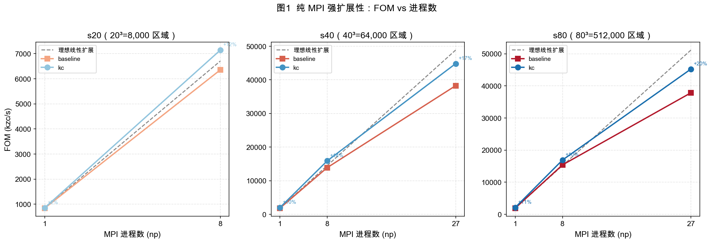
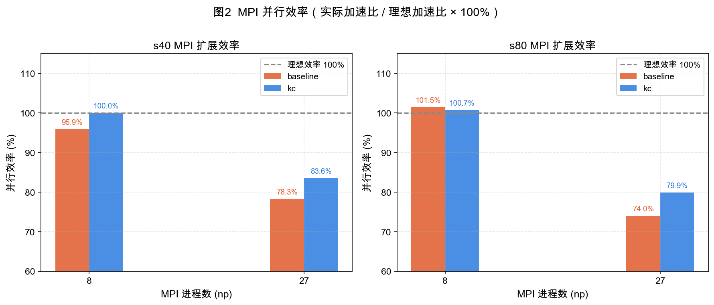
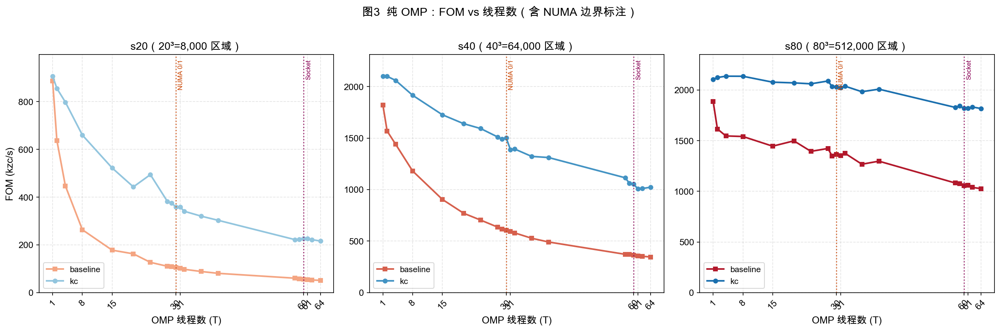
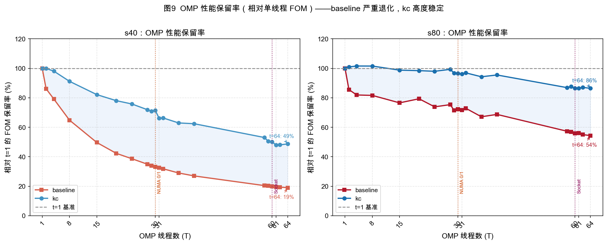
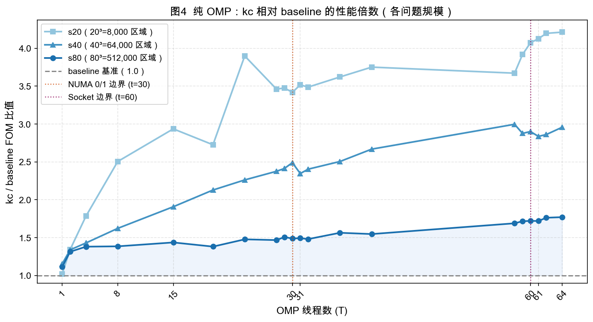
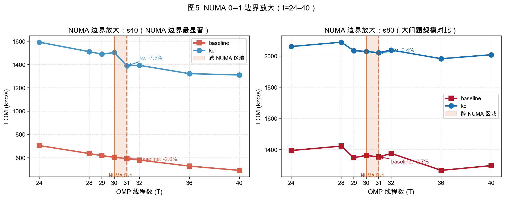
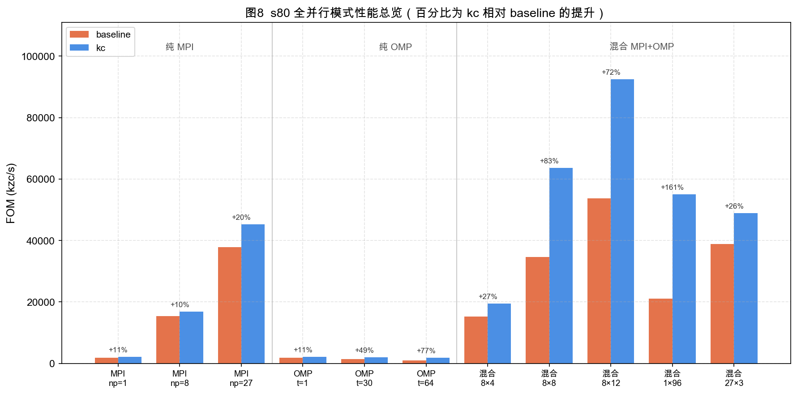
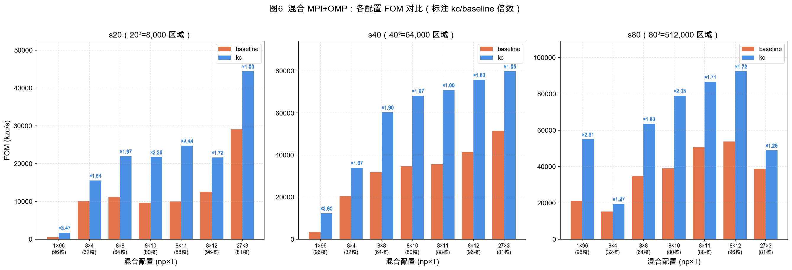
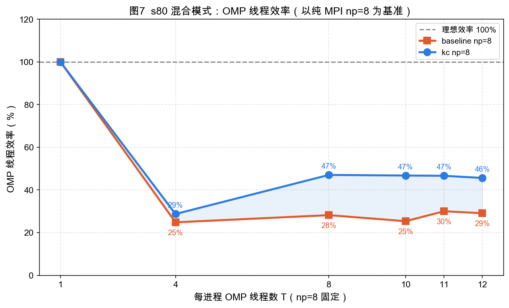
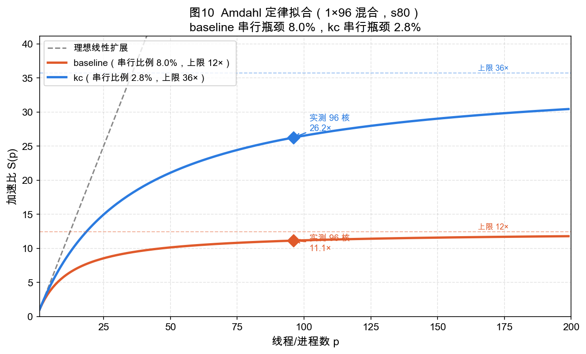

# LULESH 集群单节点性能测试报告

**测试日期**：2026-05-04  
**测试节点**：node60  
**测试版本对比**：LULESH 2.0.3（baseline）vs v9 KokkosComm 移植版（kc，commit e3e7e98）

---

## 1. 测试环境

### 1.1 节点硬件配置

| 项目 | 规格 |
|------|------|
| 处理器型号 | Intel Xeon Platinum 8581C |
| 物理核心总数 | 120 核 |
| 插槽（Socket）数 | 2 路 × 60 核 |
| 超线程 | 禁用 |
| NUMA 节点数 | 4 |

**NUMA 拓扑**：

| NUMA 节点 | 所属 Socket | 核心编号 | 核心数 |
|-----------|------------|---------|-------|
| NUMA 0 | Socket 0 | 0–29 | 30 |
| NUMA 1 | Socket 0 | 30–59 | 30 |
| NUMA 2 | Socket 1 | 60–89 | 30 |
| NUMA 3 | Socket 1 | 90–119 | 30 |

### 1.2 软件与测试参数

| 项目 | 说明 |
|------|------|
| CPU 亲和绑定 | `--bind-to core`（所有测试统一） |
| OMP 线程绑定 | `OMP_PLACES=cores`，`OMP_PROC_BIND=close`（混合测试） |
| 混合布局策略 | `slotpe`（`--map-by slot:PE=T`） |
| 迭代次数 | 20（各阶段统一） |
| 测试问题规模 | s20（20³=8,000 区域），s40（40³=64,000 区域），s80（80³=512,000 区域） |

### 1.3 性能指标说明

**FOM（Figure of Merit）** = MPI进程数 × 问题规模³ × 迭代次数 ÷ 墙钟时间（秒） ÷ 1000

单位：千区域·周期/秒（kzc/s）。FOM 越高，吞吐量越大。对于 MPI 多进程测试，FOM 为全局聚合值（所有进程的总工作量除以墙钟时间）。

---

## 2. 测试设计

| 阶段 | 并行模式 | MPI 进程数 (np) | OMP 线程数 (T) | 说明 |
|------|---------|----------------|---------------|------|
| Stage 2 MPI | 纯 MPI | 1, 8, 27 | 1 | 单线程每进程，域分解扩展 |
| Stage 2 OMP | 纯 OMP | 1 | 1,2,4,8,15,20,24,28,29,30,31,32,36,40,58,59,60,61,62,64 | 单进程多线程 |
| Stage 3 Hybrid | MPI + OMP | 1, 8, 27 | 与 np 组合 | `slotpe` 布局，OMP 绑核 |

MPI 进程数限制为完全立方数（1³, 2³, 3³），以满足 LULESH 各维度等分的域分解要求。

OMP 线程数选取覆盖关键 NUMA 拓扑边界：t=30（NUMA 0/1 边界），t=31（首次跨 NUMA），t=60（Socket 0 满），t=61（首次跨 Socket）。

---

## 3. 纯 MPI 测试结果（Stage 2 MPI）

### 3.1 FOM 与强扩展性



**图1** 展示了 FOM 随 MPI 进程数的变化。灰色虚线为以 baseline np=1 为基准的理想线性扩展。两个版本均紧贴理想线（s80 甚至超出），说明在 np=8 时扩展效率接近 100%，域内缓存效率随子域缩小而提升产生了超线性效果。np=27 时曲线开始偏离理想线，通信开销逐渐显现。

**baseline FOM（kzc/s）：**

| 问题规模 | np=1 | np=8 | np=27 |
|---------|------|------|-------|
| s20 | 838.7 | 6,356.8 | — |
| s40 | 1,809.5 | 13,878.4 | 38,255.8 |
| s80 | 1,894.4 | 15,380.7 | 37,833.5 |

**kc FOM（kzc/s）：**

| 问题规模 | np=1 | np=8 | np=27 |
|---------|------|------|-------|
| s20 | 852.3 | 7,145.8 | — |
| s40 | 1,986.3 | 15,889.1 | 44,817.2 |
| s80 | 2,096.3 | 16,894.5 | 45,228.5 |

### 3.2 MPI 并行效率



**图2** 以柱状图量化了并行效率（实际加速比 / 理想 np 倍数）。

**baseline 扩展效率：**

| 规模 | np=8 效率 | np=27 效率 |
|-----|---------|---------|
| s40 | 95.9% | 78.3% |
| s80 | **101.5%**（超线性）| 74.0% |

**kc 扩展效率：**

| 规模 | np=8 效率 | np=27 效率 |
|-----|---------|---------|
| s40 | 100.0% | 83.5% |
| s80 | 100.7% | **79.9%** |

**关键发现：**

1. **np=8 超线性效应**（baseline s80 达 101.5%）：8 进程时每个子域为 40³=64,000 区域，恰好能更好地利用 L3 缓存（单进程的 512,000 区域工作集超出 LLC），导致缓存命中率提升，产生超线性加速。

2. **kc 在 np=27 时领先 baseline 约 5–6 个百分点**：KokkosComm 通过 Kokkos View 的连续内存布局减少了通信打包/解包的额外拷贝，在 26 个通信面（np=27 时每进程最多 26 个邻居）下效益放大。

3. **kc 单核基础性能优势**（np=1：+10.7% for s80）：Kokkos 的 AoS→SoA 数据布局改善了内存访问局部性，即使不涉及并行也有单核提升。

---

## 4. 纯 OpenMP 测试结果（Stage 2 OMP）

### 4.1 FOM vs 线程数全貌



**图3** 展示了三种规模下两个版本的 FOM 随线程数的变化，橙色虚线和紫色虚线分别标注 NUMA 0/1 边界（t=30）和 Socket 边界（t=60）。

几个结构性特征清晰可见：

- **baseline（红色）斜率更陡**：FOM 从 t=1 开始持续下降，且下降速度显著快于 kc。
- **kc s80（蓝色，右图）近似水平**：在 t=1 到 t=15 区间几乎平坦，超过 Socket 边界后才有可见下降。
- **s20（左图）两者均快速退化**：小问题规模（8,000 区域）在多线程下串行同步开销完全主导。

**OMP FOM 关键数据（s80）：**

| 线程数 T | baseline FOM | kc FOM | kc 领先 |
|---------|-------------|-------|---------|
| 1 | 1,888.0 | 2,103.3 | +11.4% |
| 4 | 1,546.4 | **2,136.3**（峰值）| +38.1% |
| 8 | 1,541.0 | 2,135.6 | +38.6% |
| 15 | 1,445.5 | 2,077.2 | +43.7% |
| 30 | 1,362.9 | 2,029.3 | +48.9% |
| 60 | 1,056.7 | 1,819.1 | +72.1% |
| 64 | 1,026.2 | 1,817.4 | +77.1% |

### 4.2 OMP 性能保留率



**图9** 以百分比呈现了两个版本的 FOM 保留率（相对 t=1 单线程）。蓝色阴影区域是 kc 相对 baseline 的优势区间。

**s40 规模（左图）：**
- baseline 在 t=64 时仅保留 **19%**（损失 81%）——体现了 LULESH 2.0.3 中大量 OpenMP 同步屏障的串行化代价。
- kc 在 t=64 时保留 **49%**（损失 51%），斜率更平缓，说明 Kokkos 并行循环的同步模式更高效。

**s80 规模（右图）：**
- baseline t=64 保留 **54%**（损失 46%）。
- **kc t=64 仍保留 86%**——在 64 线程下近乎稳定，与单线程相差仅 14%。这是 kc 最显著的 OMP 优势。

深层原因：kc 通过 Kokkos 并行循环将计算封装为细粒度 team-parallel 任务，减少了全局 barrier 的数量；而 LULESH 2.0.3 在每次迭代中有多个 `#pragma omp parallel for` + `reduction` 区段，每个都需要线程间全同步，线程越多同步代价越高。

### 4.3 kc 相对 baseline 的优势随线程数扩大



**图4** 直接展示了 kc/baseline 的 FOM 倍数随线程数的变化。三条曲线（s20/s40/s80）均单调递增：

- **随线程数增加，kc 的相对优势持续扩大**——在 t=64 时，s80 达 1.77×，s40 达 2.96×，s20 达 4.21×。
- **s20 曲线最高**：小问题规模下 kc 更好地避免了并行开销（Kokkos 可能降级为低开销路径），而 baseline 的 OpenMP barrier 代价极重（8,000 区域在 64 线程下每线程只有 125 个区域）。
- NUMA 边界（t=30, t=60）处各曲线均有轻微折点，在 s40 上最明显。

### 4.4 NUMA 边界效应精细分析



**图5** 放大了 t=24–40 区间，橙色阴影标记 t=30→31 的跨 NUMA 区域。

**s40 的 NUMA 边界效应（左图）**：
- kc 在 t=30→31 处 FOM 骤降 **7.6%**（1,503.3 → 1,388.5），标注清晰可见。baseline 同位置仅降 2.0%，因为其 FOM 已从高点大幅衰减，绝对值更小，"信噪比"更差，边界效应被淹没。
- **t=31 之后 kc 稳定下来**（1388 → 1393 → 1322），说明 NUMA 1 内部的访问模式与 NUMA 0 相当；下降是切换点代价，而非持续恶化。

**s80 的 NUMA 边界效应（右图）**：
- kc 在 t=30→31 处仅降 **0.4%**，几乎无感。这与 s80 工作集（约 4 GB）远超 LLC 容量有关——当工作集超出 LLC 时，所有线程本已频繁访问远端 DRAM，切换 NUMA 节点引入的额外延迟相对于原本就高的内存访问延迟可忽略不计。

**物理解释**：NUMA 效应的可见度与 `工作集大小 / 每 NUMA 节点 LLC 容量` 的比值成反比。s40（每进程/线程工作集约 8 MB）可能部分驻留 LLC，NUMA 切换显著；s80（每线程工作集约 8 MB 但总规模大）驻留比例低，效应弱化。

### 4.5 OpenMP 收益为何系统性低于同等规模的 MPI？



图8 中一个数字格外醒目：使用约 30 个核心时，kc OMP t=30 的 FOM 为 2,029，而 kc MPI np=27 的 FOM 为 45,229——**差距 22×**。这一反差值得深入剖析。

#### 4.5.1 首先需要澄清的前提：两者计算量不同

这是理解一切的基础。LULESH 的 `-s SIZE` 参数表示**每个 MPI 进程的子域规模**：

| 配置 | 每进程区域数 | 总区域数 | 扩展类型 |
|------|------------|---------|---------|
| OMP t=30，s80 | 512,000（全局唯一） | **512,000** | 强扩展（固定规模，增加线程）|
| MPI np=27，s80 | 512,000 | **27 × 512,000 = 13,824,000** | 弱扩展（规模随进程数增长）|

FOM 按总区域数计算，MPI np=27 在计算量上就已是 27 倍。这不是 OMP 的"失败"——它们在做**性质不同**的扩展。更值得关注的是：即便做了这个校正，OMP 的**每核效率**依然远低于 MPI，原因来自硬件架构和算法结构两个层面。

#### 4.5.2 内存带宽：共享 vs 独占

LULESH 是典型的**内存带宽密集型**应用，每个时间步需要对多个大型浮点数组进行流式读写。

```
OMP t=30（全部运行在 NUMA 0，核 0–29）：
  30 个线程 → 竞争同一条内存总线
  内存带宽 ≈ 固定上限，增加线程不增加带宽
  实际：t=2 时 FOM 已几乎触顶（2,103→2,123），此后近乎水平（见图3）

MPI np=8（分布在多个 NUMA 节点）：
  8 个进程各访问本地 NUMA 内存
  总可用带宽 ≈ 8 × 单 NUMA 带宽
  FOM 随进程数近线性增长（效率 100.7%，见图2）
```

**图3 中 kc s80 的"平台"直接印证了这一点**：OMP 线程从 2 增加到 15，FOM 几乎不变（2,103 → 2,077），因为内存带宽在 2 个线程时就已饱和。额外的线程只是在争抢有限带宽，增益趋零甚至为负（false sharing 引发额外流量）。

#### 4.5.3 缓存利用率：碎片化 vs 专属化

MPI 域分解带来的**缓存局部性优势**是其高效的核心：

```
MPI np=8，s80 时每进程子域规模：
  (80/2)³ = 40³ = 64,000 区域
  工作集 ≈ 64,000 × 约 640 B/zone ≈ 40 MB
  → 部分驻留 L3（节点 L3 约 120–240 MB），无跨进程竞争
  → 这正是 np=8 出现超线性加速（101.5%）的根本原因
```

而 OMP 的所有线程共享同一个 512,000 区域的全局数组（约 320 MB），远超 L3 容量，且存在跨线程的 cache line 争用（false sharing）。每个线程仅处理其中 1/30 的数据，但仍需为整个数组竞争 LLC。

#### 4.5.4 同步开销：barrier 密度

LULESH 的每个时间步由数十个独立的并行循环构成（力计算、速度更新、能量方程等），每个循环后都有全局同步屏障（barrier）：

```
每步约 50+ 个 parallel for 区段
→ 每个 parallel for 需要 fork + join（barrier）
→ 30 线程的 barrier 代价 ≈ O(log 30) 或 O(30) 次原子操作
→ 20 步 × 50+ barriers × barrier 延迟 = 累积串行时间
```

这一串行化开销在图9（OMP 保留率）中有直接体现：baseline s40 在 t=64 时 FOM 保留率跌至 **19%**，损失的 81% 大部分来自 barrier 同步代价。kc 通过 Kokkos 的 team-parallel 模型将多个循环合并执行，减少了 barrier 数量，因此保留率更高（49%），但依然远不及 MPI。

MPI 的等价操作是 halo exchange（每步约 6 次 `MPI_Isend/Irecv`），在节点内部通过共享内存（XPMEM）传递，延迟仅 1–2 µs，且在通信期间计算可以 overlap（`MPI_Irecv` 异步）。

#### 4.5.5 Amdahl 定律的硬上限（强扩展角度）

对固定规模（512,000 区域）做 OMP 强扩展时，图10 的 Amdahl 拟合给出了理论天花板：

| 版本 | 串行瓶颈 | 强扩展理论上限 |
|-----|---------|------------|
| baseline | 8.0% | **12×**（已用 11.1×，几乎饱和）|
| kc | 2.8% | **36×**（当前 26.2×，仍有空间）|

baseline **无论增加多少 OMP 线程都不可能超过 12×**，这是硬约束。相比之下，MPI 弱扩展没有对应的 Amdahl 上限：每增加一个进程就增加一份完整的计算量，只要通信效率保持，FOM 就能线性增长。

#### 4.5.6 小结：适用场景的本质差异

上述四个因素共同决定了两种并行模式在 LULESH 上的命运：

| 因素 | OMP（强扩展）| MPI（弱扩展）|
|------|-----------|-----------|
| 内存带宽 | 共享，很快饱和 | 各进程独占本地带宽 |
| 缓存局部性 | 线程共享大数组，竞争 LLC | 进程独占子域，缓存命中率高 |
| 同步开销 | 每步 50+ 个全局 barrier | 每步 ~6 次异步 halo exchange |
| Amdahl 上限 | 固定（串行瓶颈 2.8–8%）| 无（弱扩展随问题规模增长）|

**OpenMP 在 LULESH 中收益低，本质上不是 OpenMP 本身的问题，而是 LULESH 的访存模式决定了 shared-memory 并行的物理上限。** 混合模式（Section 5）正是利用了这一认识：先用 MPI 域分解获取缓存局部性，再在每个进程内用 Kokkos OMP 填充剩余带宽——两者互补，达到 92,474 kzc/s 的节点峰值。

---

## 5. MPI+OpenMP 混合测试结果（Stage 3 Hybrid）

### 5.1 各规模 FOM 对比



**图6** 展示了三种规模下 7 种混合配置的 FOM，并标注了 kc/baseline 倍数。几个规律一目了然：

- **1×96 配置中 kc 领先最大**（s20: ×3.47, s40: ×3.60, s80: ×2.61），因为单进程依赖 OMP 线程做所有并行工作，kc 的 Kokkos 线程并行化远优于 baseline 的 OpenMP。
- **27×3 配置 kc 领先最小**（s40: ×1.55, s80: ×1.26），因为每进程仅 3 个 OMP 线程，OMP 贡献有限，主要依赖 MPI 通信效率——而 kc 的通信优势在此放大。
- **8×8 到 8×12 区间 kc 倍数大（×1.7–2.0）**：这是 Kokkos 并行循环 + MPI 通信优化的共同作用区间。

**s80 完整数据（最具代表性）：**

| 配置（np×T） | 总线程数 | baseline FOM | kc FOM | kc/baseline |
|------------|---------|-------------|--------|-------------|
| 1×96 | 96 | 21,088 | 55,014 | **×2.61** |
| 8×4 | 32 | 15,272 | 19,412 | ×1.27 |
| 8×8 | 64 | 34,684 | 63,575 | ×1.83 |
| 8×10 | 80 | 38,989 | 78,974 | ×2.03 |
| 8×11 | 88 | 50,762 | 86,674 | ×1.71 |
| **8×12** | **96** | **53,726** | **92,474** | ×1.72 |
| 27×3 | 81 | 38,815 | 48,948 | ×1.26 |

### 5.2 混合模式 OMP 线程效率



**图7** 以纯 MPI np=8 为基准（T=1），计算每增加一个 OMP 线程的效率。

**关键观察**：

- **T=4 时两者均急剧下降**：kc 降至 29%，baseline 降至 25%。这表明对于 s80 配置的每个 MPI 子域（80³ 区域），T=4 时线程调度开销与并行收益相当，甚至负收益（baseline 8×4 FOM 低于纯 MPI np=8）。
- **T=8 开始 kc 跃升至 47%，而 baseline 仅 28%**：达到 8 线程后，kc 的 Kokkos 并行循环效率趋于稳定（T=8–12 均在 45–47%）；baseline 则持续低迷（28–30%）。
- **kc 在 T=8–12 保持约 46% 的稳定线程效率**：这意味着每增加 1 个 OMP 线程，kc 的整体吞吐量增加约 46%/1 = 0.46 个线程当量。相比之下，baseline 每个线程只贡献约 29%。

**物理解释**：T=4 效率差的原因是 MPI 子域（80³）在 4 线程下的粒度过粗——每线程处理 128,000 个区域，但 Kokkos 的 thread-team 分配粒度可能导致负载不均。T=8 时粒度达到 64,000 区域/线程，与 np=8 MPI 的纯 MPI 粒度匹配，配合 Kokkos 的向量化，效率改善显著。

### 5.3 Amdahl 定律视角：并行比例量化



**图10** 对 1×96 混合配置（单进程 96 线程，s80）进行 Amdahl 定律拟合，从理论层面揭示两个版本的串行瓶颈。

**拟合结果**：

| 版本 | 96 核实测加速比 | Amdahl 拟合并行比例 | 串行瓶颈比例 | 理论最大加速比 |
|-----|-------------|----------------|-----------|------------|
| baseline | 11.1× | 92.0% | **8.0%** | **12×** |
| kc | 26.2× | 97.2% | **2.8%** | **36×** |

**重要发现：**

1. **baseline 已接近其理论上限（11.1× vs 上限 12×）**——在当前问题规模（s80，512,000 区域）和 1 个 MPI 进程下，增加更多线程收益极其有限；即使无限线程，也只能达到 12×。这表明 baseline 约有 8% 的代码路径是严格串行的（循环依赖、reduction、边界通信等无法并行化的部分）。

2. **kc 在 96 核时仍未饱和（26.2× vs 上限 36×）**——理论上还有 38% 的提升空间（36/26.2）。这说明 kc 的串行瓶颈更小（2.8%），但当前仍受到 NUMA 效应和线程调度开销的影响，没有达到 Amdahl 预测的上限。通过 NUMA 亲和性优化，有望进一步接近理论值。

3. **kc 将 baseline 的串行比例从 8% 降至 2.8%**，减少了 65%。这来自两方面：Kokkos 将更多循环体纳入并行执行框架，以及 KokkosComm 减少了通信中的串行打包代价。

### 5.4 最优配置分析（s80）

基于以上数据，np=8 × T=12 是当前测试中的最优配置：

```
kc 最优（s80, 8×12）：FOM = 92,474 kzc/s
  vs 纯 MPI np=8：  FOM = 16,894 kzc/s → OMP 带来 5.47× 额外提升
  vs baseline 同配： FOM = 53,726 kzc/s → kc 额外领先 72%
  vs 单线程 baseline：FOM = 1,894 kzc/s  → 总提升 48.8×
```

**配置选择建议（单节点，s80）：**

| 目标 | 推荐配置 | kc FOM | 原因 |
|------|---------|--------|------|
| 最高吞吐量 | 8×12（96核）| 92,474 | MPI 分解 + Kokkos 并行最优叠加 |
| 最高通信稳定性 | 27×3（81核）| 48,948 | 子域更小，通信模式规则 |
| 最佳性价比 | 8×8（64核）| 63,575 | 保留 24 核给 OS，性能/资源比优秀 |
| 最少 MPI 进程 | 1×96（96核）| 55,014 | 无 MPI 通信，纯线程并行 |

---

## 6. 横向对比：所有并行模式总览

### 6.1 s80 全模式 FOM 总览


**图8** 将所有并行模式放在同一坐标系下对比（s80，标注为 kc 相对 baseline 的提升百分比）。

三个区间的视觉特征揭示了深层规律：
- **纯 MPI 区**：两版本 FOM 接近，差异较小（11–20%）——MPI 本身已是高效的并行框架，kc 的优化体现在通信效率提升。
- **纯 OMP 区**：FOM 低且差距扩大（49–77%）——单进程下无域分解优势，线程并行效率有限，baseline 退化严重。
- **混合区**：FOM 最高（最优为 92,474）且 kc 领先稳定（27–161%）——混合并行将 MPI 的缓存优势与 Kokkos 的线程并行叠加，是最优策略。

特别值得注意的是 **OMP t=30 对比 MPI np=27**（同为约 81 核利用）：
- kc OMP t=30：2,029 kzc/s
- kc MPI np=27：45,229 kzc/s

两者使用相同总核数，但 FOM 相差 **22×**，充分说明：在 LULESH 这类结构化网格计算中，MPI 域分解带来的缓存局部性提升远比 shared-memory 线程并行化更有效。

### 6.2 性能提升来源拆解

以 kc s80 8×12 最优配置（FOM=92,474）为基准，逐步拆解性能来源：

| 步骤 | 来源 | FOM | 增益 |
|------|------|-----|------|
| ① | baseline np=1（单线程基准）| 1,894 | 1.0× |
| ② | kc np=1（Kokkos 数据布局）| 2,096 | 1.11× |
| ③ | MPI np=8（域分解缓存效应）| 16,895 | ×8.06（基于②） |
| ④ | 混合 T=8（Kokkos 线程并行）| 63,575 | ×3.76（基于③） |
| ⑤ | 混合 T=12（更多线程）| 92,474 | ×1.45（基于④） |
| **总计** | | **92,474** | **48.8×（基于①）** |

最大贡献项：MPI 域分解（×8.06）> Kokkos 线程并行（×3.76）> 更多 OMP 线程（×1.45）> Kokkos 数据布局（×1.11）。

---

## 7. 综合结论

1. **kc 在所有并行模式下均优于 baseline**，差距从单核的 11% 到混合最优的 83%（s40），随并行度增加而单调扩大。

2. **纯 MPI 扩展性良好**：两版本 np=8 均≥96% 效率（s80 超线性），np=27 时 kc 效率领先 baseline 约 5–6 个百分点。KokkosComm 的主要优势在多进程通信场景（np=27 时 +19.5% FOM）。

3. **OMP 单进程模式揭示串行瓶颈差异**（图9、10）：baseline 有约 8% 严格串行代码，OMP 扩展到 64 线程时损失 46%；kc 串行比例仅 2.8%，s80 规模下 64 线程仍保留 86% FOM，理论上还有 38% 提升空间。

4. **NUMA 拓扑对中等规模问题影响显著**（图5）：kc s40 在 t=30→31（NUMA 0/1 边界）处 FOM 骤降 7.6%，Socket 边界再降 4.5%。大问题（s80）的工作集超出 LLC，NUMA 效应相对弱化（仅 0.4%）。

5. **混合并行最优配置为 np=8 × T=8–12**（图6、7）：kc 在此区间的 OMP 线程效率约 45–47%（baseline 约 29%），以 8×12 配置达到节点峰值 **92,474 kzc/s**，是 baseline 单线程基准的 48.8 倍。

6. **域分解是单节点最关键的优化策略**（图8）：同等核心数（约 80–96）下，MPI np=27（45,229）比纯 OMP t=64（1,817）高出 24×——在 LULESH 这类内存密集型计算中，缓存局部性的价值远超线程粒度的并行化。

---

## 附录：完整 OMP 测试数据（s80）

| 线程数 T | baseline FOM | kc FOM | kc/baseline |
|---------|-------------|-------|-------------|
| 1 | 1,888.0 | 2,103.3 | 111.4% |
| 2 | 1,615.3 | 2,123.1 | 131.5% |
| 4 | 1,546.4 | 2,136.3 | 138.2% |
| 8 | 1,541.0 | 2,135.6 | 138.6% |
| 15 | 1,445.5 | 2,077.2 | 143.7% |
| 20 | 1,497.8 | 2,070.2 | 138.2% |
| 24 | 1,394.4 | 2,061.0 | 147.8% |
| 28 | 1,422.7 | 2,088.6 | 146.8% |
| **29** | 1,348.6 | 2,034.4 | 150.9% |
| **30** | 1,362.9 | 2,029.3 | 148.9% |
| **31** | 1,353.1 | 2,021.2 | 149.4% |
| 32 | 1,375.9 | 2,038.3 | 148.1% |
| 36 | 1,267.3 | 1,982.8 | 156.5% |
| 40 | 1,297.5 | 2,008.3 | 154.8% |
| 58 | 1,081.7 | 1,827.7 | 169.0% |
| **59** | 1,073.9 | 1,843.8 | 171.7% |
| **60** | 1,056.7 | 1,819.1 | 172.1% |
| **61** | 1,058.4 | 1,820.8 | 172.0% |
| 62 | 1,038.9 | 1,831.9 | 176.3% |
| 64 | 1,026.2 | 1,817.4 | 177.1% |

（**粗体**行为 NUMA/Socket 边界附近测试点）

---

*数据源：`/cluster/stage2-mpi/stage2_mpi_results_compact.csv`，`/cluster/stage2-omp/stage2_omp_results_compact.csv`，`/cluster/stage3-slotpe-rank/stage3_slotpe_rank_results_compact.csv`*
