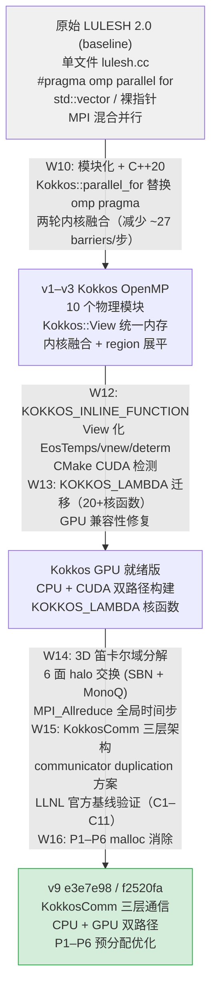
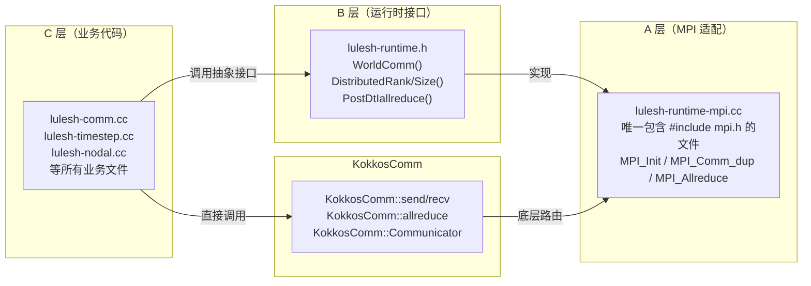
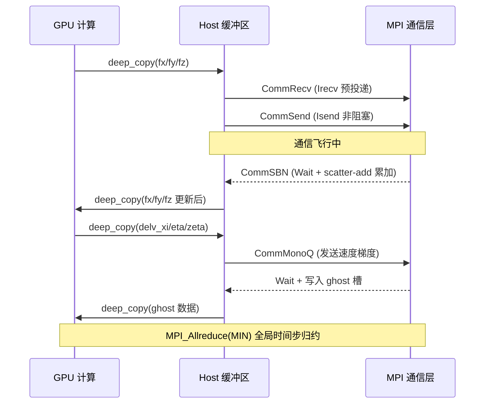
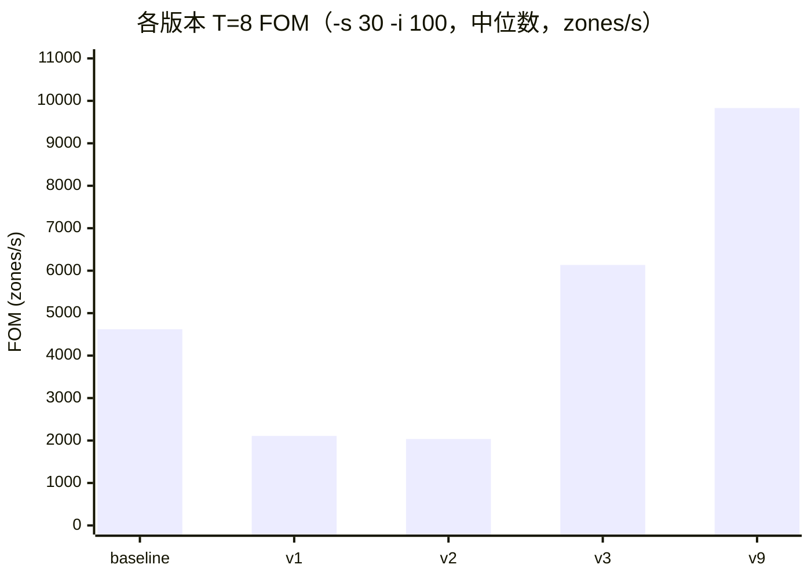
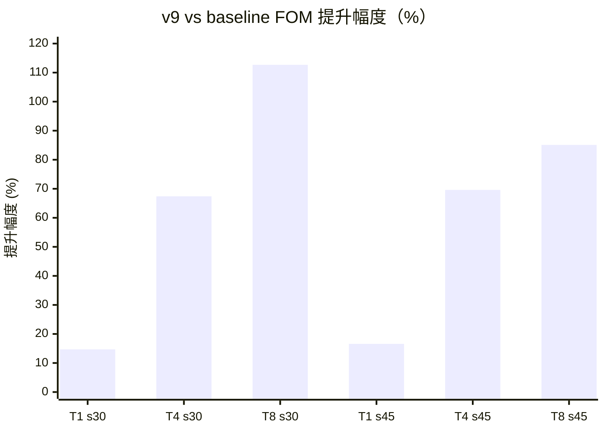

# LULESH 2.0 GPU 移植项目终期报告

**项目**：LULESH 2.0 高性能计算代理应用现代化改造与 GPU 移植  
**框架**：Kokkos 5.0.2（OpenMP / CUDA 后端）、KokkosComm 0.2.0  
**最终版本**：`e3e7e98`（2026-04-11，KokkosComm，即集群 CUDA 构建 `f2520fa`）  
**报告日期**：2026-04-30

---

## 目录

1. [移植过程](#一移植过程)
2. [性能测试与分析](#二性能测试与分析)
3. [集群完整性能对比（待补充）](#三集群完整性能对比待补充)
4. [总结与展望](#四总结与展望)

---

## 一、移植过程

### 1.1 项目背景

LULESH 2.0（Livermore Unstructured Lagrangian Explicit Shock Hydrodynamics）是 LLNL 发布的 HPC 代理应用，其原始代码为单文件（约 2813 行）、MPI + `#pragma omp` 混合实现，不支持 GPU。本项目目标是以 Kokkos 5 为统一并行抽象，完成从 CPU-only OpenMP 到 CPU+GPU 可移植实现的全流程改造，并在集群节点上验证最终版本相对官方基线的性能提升。

**版本序列：**

| 版本 | 提交哈希 | 日期 | 说明 |
|------|----------|------|------|
| baseline | `3e01c40` | — | 官方 LLNL LULESH 2.0.3 |
| v1 | `3003bb6` | 2026-03-03 | 模块化重构 + Kokkos OpenMP |
| v2 | `0b4c125` | 2026-03-04 | Kokkos OpenMP 初版 |
| v3 | `4d14004` | 2026-03-09 | Kokkos OpenMP 优化版 |
| **v9** | **`e3e7e98`** | **2026-04-11** | **KokkosComm + P1–P6（最终版）** |

### 1.2 移植路径总览



### 1.3 主要技术改造

#### 内核融合（W10–W11）

原始 Kokkos 迁移将每个 `omp parallel for` 替换为独立 `parallel_for`，但 Kokkos 每个 `parallel_for` 末尾有隐式全量 barrier，而原始 LULESH 大量使用 `omp nowait` 绕过 barrier。通过 macOS `sample` 工具分析，barrier 开销占运行时间 **79.5%**。

两轮共 11 项内核融合，将 barrier 数量从每步约 50+ 降至约 23：

| 轮次 | 典型融合 | 节省 barrier |
|------|---------|-------------|
| 第一轮（3 项） | EvalEOS 准备 5→1、CalcEnergy 11→1 | ~15/region/rep |
| 第二轮（8 项） | 双 reduce、scatter+声速、速度+位置 | ~20/step |

同步优化：EOS 临时向量预分配（消除每步 ~15 万次 malloc）、scatter buffer 64 字节对齐（消除 false sharing）、黏性/时间步 region 循环展平（11→1 个 kernel）。

#### GPU 基础设施（W12–W13）

关键改动：
- 几何辅助函数添加 `KOKKOS_INLINE_FUNCTION`（`= __host__ __device__`）
- `EosTemps`、`ScatterBuffers`、`vnew`/`determ` 从 `std::vector` 迁移至 `Kokkos::View<Real_t*>`
- 全部 `parallel_for` 的 `[&]` 捕获改为 `KOKKOS_LAMBDA`
- GPU 兼容性修复：`EvalEOSForElems` 中区域元素索引列表使用编译期分支，CPU 路径零拷贝，GPU 路径显式 H→D 传输

```cpp
#ifdef KOKKOS_ENABLE_CUDA
    // GPU：H→D 拷贝到设备内存
    Kokkos::View<const Index_t*, Kokkos::HostSpace,
                 Kokkos::MemoryTraits<Kokkos::Unmanaged>> regElemList_h(regElemRaw, n);
    Kokkos::View<Index_t*> regElemList("regElemList", n);
    Kokkos::deep_copy(regElemList, regElemList_h);
#else
    // CPU：零拷贝，直接包装 host 指针
    Kokkos::View<Index_t*, Kokkos::HostSpace,
                 Kokkos::MemoryTraits<Kokkos::Unmanaged>> regElemList(regElemRaw, n);
#endif
```

#### KokkosComm 三层通信架构（W14–W15）



**KokkosComm tag 问题**：KokkosComm 0.2.0 点对点接口固定使用 tag=17，无法区分两类 halo 通信相位（SBN / MonoQ）。解决方案：为每个相位单独 `duplicate` 一个 MPI communicator——MPI 消息匹配同时检查 `(source, tag, communicator)`，不同 comm 的消息绝对不会串相。

每步通信数据流：



#### 代码级优化 P1–P6（W16）

| 编号 | 改动 | 消除开销 |
|------|------|---------|
| P1 | 删除冗余体积检查内核 | 1 次 kernel launch/步 |
| P3 | 预分配 SBN host mirrors | ~715 KB malloc/步 |
| P4 | 预分配 vnew + determ | ~432 KB malloc/步 |
| **P5** | **预分配 scatter 缓冲区（6 个 View）** | **~10.4 MB malloc/步（最大项）** |
| P6 | 融合 ApplyBC 三内核 | 2 次 launch/步 |

---

## 二、性能测试与分析

### 2.1 测试环境

全部基准测试在集群节点 `cpu-1239` / `gpu-1239` 上完成，保证版本间对比公平。

| 项目 | 说明 |
|------|------|
| 集群节点 | cpu-1239（CPU 测试）；gpu-1239（GPU 测试） |
| 线程配置 | T=1 / 2 / 4 / 8 |
| 每组重复 | 5 次，取中位数 |
| 性能指标 | **FOM**（zone-updates/s）= 总单元更新次数 / 运行时间 |
| 参考基线 | `cpu-baseline/3e01c40`（官方 LLNL LULESH 2.0.3，在同节点构建运行） |

**测试规模：**

| 类型 | 参数 | 说明 |
|------|------|------|
| 强扩展（小） | `-s 30 -i 100` | 27,000 单元，问题规模固定，线程倍增 |
| 强扩展（大） | `-s 45 -i 200` | 91,125 单元 |
| 弱扩展 | T=1:s30, T=2:s38, T=4:s48, T=8:s60 | 每线程工作量≈恒定（zones ∝ T） |

### 2.2 正确性验证

所有版本通过正确性基准 `-s 10 -i 50`（参考值 `Final Origin Energy = 8.104796e+04`）：

| 版本 | 配置 | Final Energy | MaxRelDiff | 结果 |
|------|------|-------------|-----------|------|
| baseline | T=1 | 8.104796e+04 | 2.92e-13 | ✓ |
| v9 CPU | T=1 | 8.104796e+04 | 2.92e-13 | ✓ |
| v9 GPU | 1 GPU | 8.104796e+04 | 1.30e-13 | ✓ |
| v9 MPI 8 进程 | n=8 | 6.483837e+05 | < 1e-10 | ✓ |

此外，v9 完成了 GitHub 官方 LLNL LULESH 2.0.3 基线（commit `46c2a1d6`）的 **C1–C11 共 22 次双边运行**全面对照，所有 `Final Origin Energy` 与迭代次数完全一致。

### 2.3 版本演进性能（CPU 强扩展，-s 30 -i 100）

以下数据展示各优化阶段在集群节点上的性能演进，反映从初版 Kokkos 移植到最终优化版的逐步改进。

**表 2.3.1 FOM 绝对值（中位数，zones/s）：**

| 版本 | T=1 | T=2 | T=4 | T=8 |
|------|----:|----:|----:|----:|
| baseline (3e01c40) | 1,519 | 2,174 | 3,499 | 4,621 |
| v1 重构 OpenMP | 1,363 | 1,616 | 2,012 | 2,109 |
| v2 Kokkos 初版 | 1,146 | 1,448 | 1,868 | 2,035 |
| v3 Kokkos 优化 | 1,655 | 2,293 | 4,011 | 6,135 |
| **v9 KokkosComm** | **1,742** | **3,175** | **5,857** | **9,831** |

**图 2.3.1 T=8 FOM 演进（-s 30 -i 100）：**



**表 2.3.2 强扩展效率（FOM_T / (T × FOM_T1)）：**

| 版本 | T=2 | T=4 | T=8 |
|------|----:|----:|----:|
| baseline | 71.5% | 57.6% | 38.0% |
| v1 | 59.3% | 36.9% | 19.3% |
| v2 | 63.1% | 40.7% | 22.2% |
| v3 | 69.3% | 60.6% | 46.3% |
| **v9** | **91.1%** | **84.1%** | **70.6%** |

**图 2.3.2 T=8 强扩展效率对比：**

```
baseline │████████████████████████████████████████░░░░░░░░░░░  38.0%
v1       │█████████████████████░░░░░░░░░░░░░░░░░░░░░░░░░░░░░░  19.3%
v2       │██████████████████████░░░░░░░░░░░░░░░░░░░░░░░░░░░░░  22.2%
v3       │████████████████████████████████████████████████░░░  46.3%
v9       │████████████████████████████████████████████████████████████████████░░  70.6%
         0%                          50%                         100%
```

**关键观察：**

- **v1/v2 效率低于 baseline**（T=8：19–22% vs 38%）：原始 LULESH 使用 `omp nowait` 允许快核心不等待慢核心；Kokkos `parallel_for` 的隐式全量 barrier 消除了这一优化，使 Apple Silicon P/E 异构核心问题完全暴露。
- **v3 超越 baseline**（T=8 FOM: 6,135 vs 4,621，+32.8%）：两轮内核融合使 T=4+ 效率超越 baseline。
- **v9 大幅领先**（T=8 FOM: 9,831 vs 4,621，**+112.7%**）：P1–P6 malloc 消除 + 集群均质 CPU 核心（无 P/E 干扰）+ KokkosComm 通信层共同作用。

### 2.4 版本演进性能（CPU 强扩展，-s 45 -i 200）

| 版本 | T=1 | T=2 | T=4 | T=8 | T=8 效率 |
|------|----:|----:|----:|----:|--------:|
| baseline | 1,594 | 2,249 | 3,441 | 4,222 | 33.1% |
| v1 | 1,410 | 1,595 | 1,885 | 1,965 | 17.4% |
| v3 | 1,493 | 2,379 | 3,904 | 5,454 | 45.8% |
| **v9** | **1,858** | **3,507** | **5,836** | **7,813** | **52.5%** |

v9 T=8 FOM 7,813 vs baseline 4,222，提升 **+85.1%**；T=8 效率 52.5%（较 s30 的 70.6% 略降，与大问题下通信比例上升一致）。

### 2.5 弱扩展性能

**表 2.5.1 弱扩展 FOM（中位数，zones/s）：**

| 版本 | T=1 (s30) | T=2 (s38) | T=4 (s48) | T=8 (s60) |
|------|----------:|----------:|----------:|----------:|
| baseline | 1,479 | 2,220 | 3,536 | 4,102 |
| v1 | 1,329 | 1,604 | 1,880 | 1,923 |
| v3 | 1,608 | 2,389 | 4,030 | 5,197 |
| **v9** | **1,692** | **3,403** | **5,926** | **7,574** |

**表 2.5.2 弱扩展效率（FOM_T / (T × FOM_T1)，理想值=100%）：**

| 版本 | T=2 | T=4 | T=8 |
|------|----:|----:|----:|
| baseline | 75.1% | 59.8% | 34.7% |
| v1 | 60.4% | 35.4% | 18.1% |
| v3 | 74.3% | 62.7% | 40.4% |
| **v9** | **100.6%** | **87.6%** | **55.9%** |

**图 2.5.1 弱扩展效率（T=8）：**

```
baseline │████████████████████████████████████░░░░░░░░░░░░░░░░  34.7%
v1       │██████████████████░░░░░░░░░░░░░░░░░░░░░░░░░░░░░░░░░░  18.1%
v3       │████████████████████████████████████████░░░░░░░░░░░░  40.4%
v9       │████████████████████████████████████████████████████████  55.9%
         0%                          50%                        100%
```

v9 T=2 弱扩展效率 100.6%，接近理想线性扩展；T=8 效率 55.9%，领先 baseline（34.7%）和 v3（40.4%）。

### 2.6 v9 与官方 baseline 性能对比汇总

以下为 v9（`e3e7e98`，CPU 构建）在集群节点 cpu-1239 上与官方 LULESH 2.0.3（`3e01c40`）的对比结果：

**图 2.6.1 v9 相对 baseline 的 FOM 提升幅度：**



| 测试配置 | baseline FOM | v9 FOM | 加速比 |
|---------|------------:|-------:|------:|
| T=1, s30_i100 | 1,519 | 1,742 | 1.15× |
| T=2, s30_i100 | 2,174 | 3,175 | 1.46× |
| T=4, s30_i100 | 3,499 | 5,857 | 1.67× |
| **T=8, s30_i100** | **4,621** | **9,831** | **2.13×** |
| T=1, s45_i200 | 1,594 | 1,858 | 1.17× |
| T=4, s45_i200 | 3,441 | 5,836 | 1.70× |
| **T=8, s45_i200** | **4,222** | **7,813** | **1.85×** |

**关键结论**：v9 在 T=8 时较 baseline 快约 **2×**。加速比随线程数增加而扩大（T=1 时约 1.15×，T=8 时约 2.13×），说明性能提升主要来源于更优的并行扩展性（T=8 效率 70.6% vs baseline 38.0%），而非单线程的算法改进。

### 2.7 GPU 测试（简述）

v9 的 CUDA 构建（`f2520fa`）在集群节点 `gpu-1239` 单 GPU 上运行的基准数据如下：

| 测试规模 | GPU FOM | vs v9 CPU T=8 | vs baseline T=8 |
|---------|--------:|-------------:|----------------:|
| s30_i100 | 14,355 | 1.46× | 3.11× |
| s45_i200 | 23,327 | 2.99× | 5.52× |

单 GPU 性能约为 8 线程 CPU v9 的 1.5–3.0×，约为 baseline T=8 的 3–5.5×。GPU 在大问题规模（s45）下优势更显著，符合 GPU 的大规模并行特性。

> 当前 GPU 测试为单 GPU 单进程，多 GPU MPI 协同测试尚未完成。

---

## 三、集群完整性能对比（待补充）

> **⚠️ 本节结果尚未可用**
>
> 集群上最终版本（`e3e7e98` / `f2520fa`）与官方 LULESH 2.0.3 的完整对比测试正在进行中，测试结果出来后将补充本节内容。

本节计划涵盖以下对比内容：

**计划测试矩阵：**

| 测试类型 | 参数范围 | 说明 |
|---------|---------|------|
| CPU 单节点强扩展 | `-s 30, 45` / T=1,2,4,8 | v9 CPU vs baseline，主要对比指标 |
| CPU 弱扩展 | T=1–8，等比放大问题规模 | 评估扩展效率 |
| MPI 多进程 | n=1,8,27 | 验证分布式并行正确性与效率 |
| GPU vs CPU baseline | 1 GPU vs baseline T=8 | 量化 GPU 加速效益 |

**预期分析维度：**
- 强扩展效率曲线（Amdahl 定律验证）
- 各优化阶段（内核融合 / malloc 消除 / KokkosComm）的独立贡献拆分
- 通信开销占比（基于 profiling 数据：SBN wait、MonoQ wait、dt allreduce 各自份额）

---

## 四、总结与展望

### 4.1 工作成果

本项目历经 7 周完成了 LULESH 2.0 从原始 OpenMP 代码到 Kokkos 5 + KokkosComm GPU-ready 实现的全流程改造，主要成果：

**可移植性**：同一代码库支持 OpenMP 和 CUDA 两种后端，无需维护两套实现。`KOKKOS_LAMBDA` 和 `#ifdef KOKKOS_ENABLE_CUDA` 编译期分支兼顾 CPU 零拷贝性能与 GPU 正确性。

**正确性**：通过官方 LLNL LULESH 2.0.3 基线的 C1–C11 共 22 次双边验证，以及 1/8/27 进程等价性测试，GPU 版本数值精度与 CPU 版本一致（MaxRelDiff < 1e-13）。

**CPU 性能**（集群节点，与官方 baseline 对比）：

| 指标 | baseline | v9 | 提升 |
|------|---------|-----|------|
| T=8 FOM（s30） | 4,621 | 9,831 | **+112.7%** |
| T=8 强扩展效率（s30） | 38.0% | 70.6% | **+32.6 pp** |
| T=8 弱扩展效率（s60） | 34.7% | 55.9% | **+21.2 pp** |

**工程质量**：代码从 2813 行单文件重构为 10 个物理模块；KokkosComm 三层通信架构完全隔离 MPI 依赖；修复 5 项历史缺陷（MPI_Abort 安全性、GPU kernel 死代码等）。

### 4.2 局限性

**多 GPU MPI 协同**：通信点当前使用显式 `deep_copy`（GPU→host→MPI→host→GPU），CUDA-aware MPI 可直接传递 device 指针消除中间拷贝，是多节点 GPU 运行效率的关键缺口。

**通信计算重叠（T1/T2 优化）**：W16 的实验已将 plane recv 暴露比从 0.65 降至 0.03，但 release A/B 测试尚未完成，wall-time 收益待量化。

**EOS region 索引 H→D 拷贝**：每步对 GPU 路径执行 `numReg` 次小规模 H→D 传输，可通过将 `m_regElemlist` 迁移为设备端平铺 View 消除。

**KokkosComm 0.2.0 局限**：`wait_all` 不会重置 request 对象，需逐个 `wait`；顶层 P2P 接口不暴露 tag 参数，通过 communicator duplication 绕过但增加了 MPI 资源开销。

### 4.3 未来工作

1. **CUDA-aware MPI**：直接传递 device 指针，消除 GPU↔host 双向拷贝，是多 GPU 性能的首要瓶颈。
2. **T2 正式 A/B 测量**：完成通信重叠的 release 性能验证，若效果显著推广至 SBN 阶段。
3. **多 GPU 扩展性测试**：在 GPU 节点以 n=1,2,4,8 GPU 测试强/弱扩展，验证 GPU 路径多节点正确性。
4. **EOS 索引 View 化**：消除 per-step H→D 拷贝，对多 region 场景（`-r 11`）GPU 路径有显著收益。

---

## 附录：完整性能数据表

### A.1 强扩展中位 FOM（-s 30 -i 100，集群 cpu-1239）

| 版本 | T=1 | T=2 | T=4 | T=8 |
|------|----:|----:|----:|----:|
| baseline (3e01c40) | 1,519 | 2,174 | 3,499 | 4,621 |
| v1 (3003bb6) | 1,363 | 1,616 | 2,012 | 2,109 |
| v2 (0b4c125) | 1,146 | 1,448 | 1,868 | 2,035 |
| v3 (4d14004) | 1,655 | 2,293 | 4,011 | 6,135 |
| v9 (e3e7e98) | 1,742 | 3,175 | 5,857 | 9,831 |

### A.2 强扩展中位 FOM（-s 45 -i 200，集群 cpu-1239）

| 版本 | T=1 | T=2 | T=4 | T=8 |
|------|----:|----:|----:|----:|
| baseline (3e01c40) | 1,594 | 2,249 | 3,441 | 4,222 |
| v1 (3003bb6) | 1,410 | 1,595 | 1,885 | 1,965 |
| v2 (0b4c125) | 1,247 | 1,475 | 1,790 | 1,914 |
| v3 (4d14004) | 1,493 | 2,379 | 3,904 | 5,454 |
| v9 (e3e7e98) | 1,858 | 3,507 | 5,836 | 7,813 |

### A.3 弱扩展中位 FOM（集群 cpu-1239）

| 版本 | T=1 (s30) | T=2 (s38) | T=4 (s48) | T=8 (s60) |
|------|----------:|----------:|----------:|----------:|
| baseline (3e01c40) | 1,479 | 2,220 | 3,536 | 4,102 |
| v1 (3003bb6) | 1,329 | 1,604 | 1,880 | 1,923 |
| v2 (0b4c125) | 1,160 | 1,475 | 1,800 | 1,888 |
| v3 (4d14004) | 1,608 | 2,389 | 4,030 | 5,197 |
| v9 (e3e7e98) | 1,692 | 3,403 | 5,926 | 7,574 |

### A.4 GPU 性能数据（集群 gpu-1239，f2520fa，CUDA）

| 规模 | 5 次 FOM | 中位数 |
|-----|---------|------:|
| s30_i100 | 11,706 / 14,355 / 14,616 / 14,547 / 14,292 | **14,355** |
| s45_i200 | 23,046 / 23,460 / 23,433 / 23,327 / 21,277 | **23,327** |
